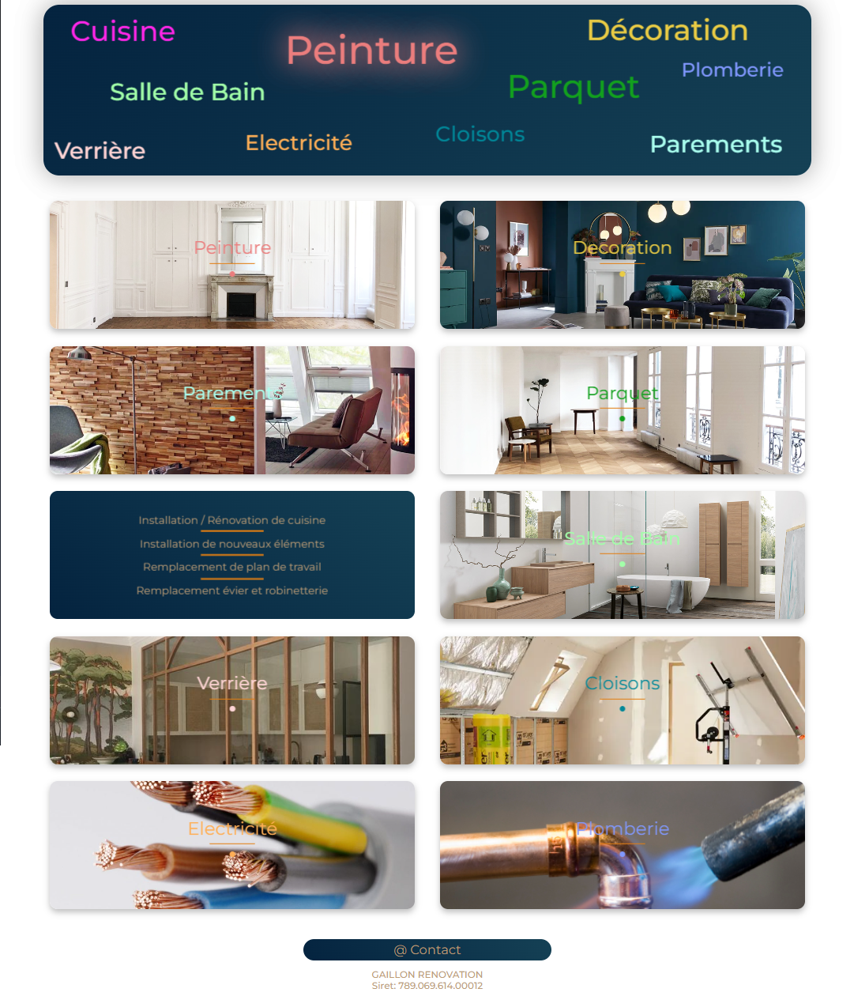
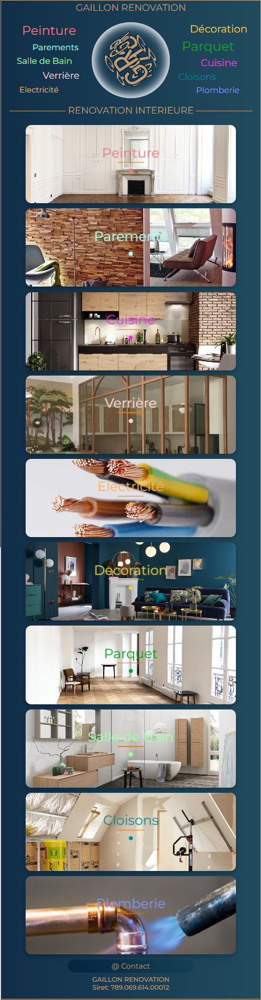

<h1>GAILLON RENOVATION - Company Website </h1>

<div align='center'>

 
 
</div><br>


<strong>Project:</strong> From scratch, I created it for my company. This is a single page app, responsive and has a mobile version.


<strong>Install dependencies:</strong>

```
npm i
```

<strong>run dev preview:</strong>

```
npm run dev
```

<strong> Screenshots:</strong><br>

<div align='center'>

 

 

 

 
 
</div>